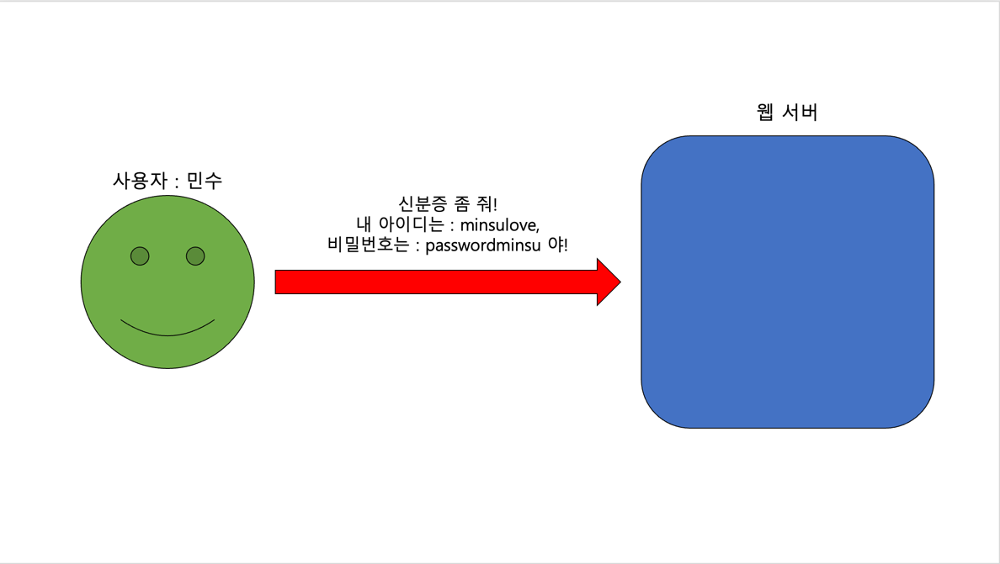
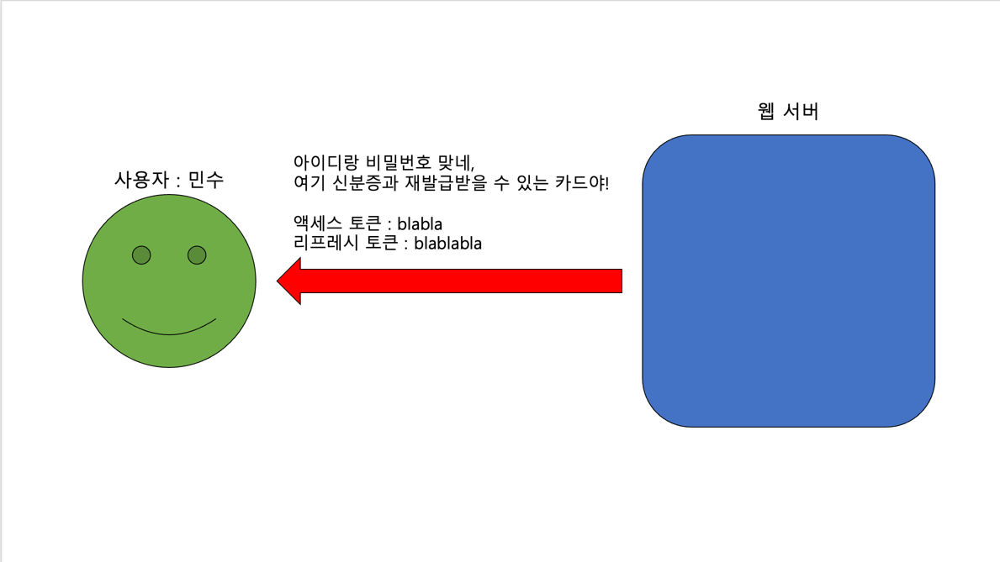
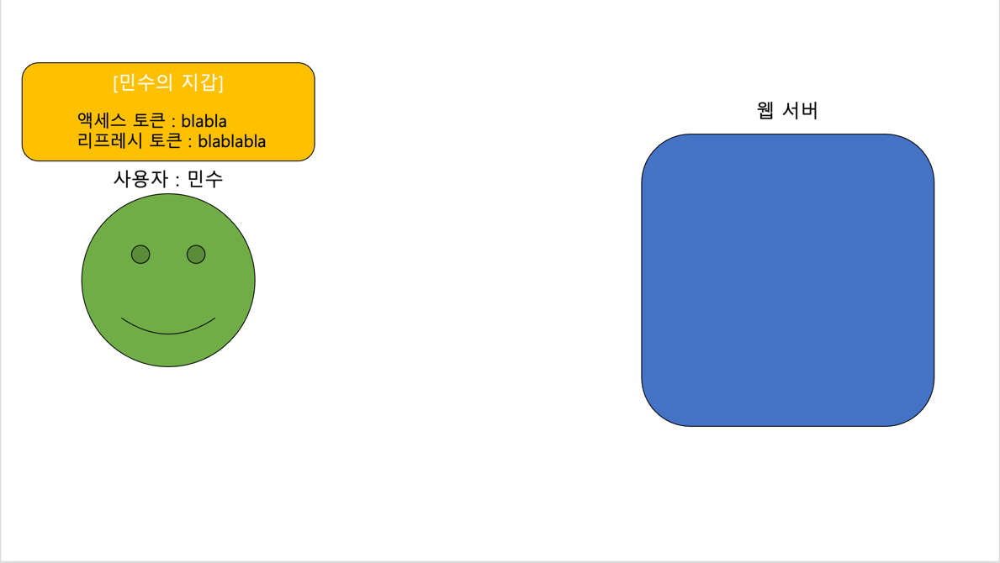
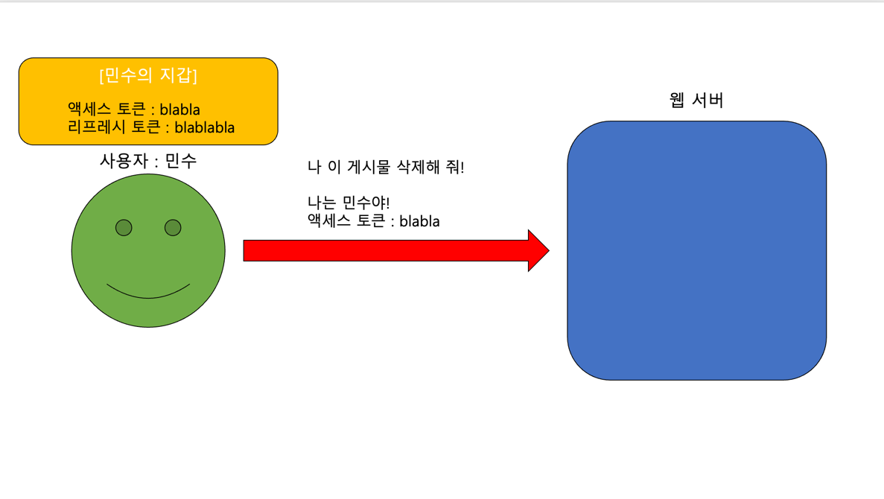
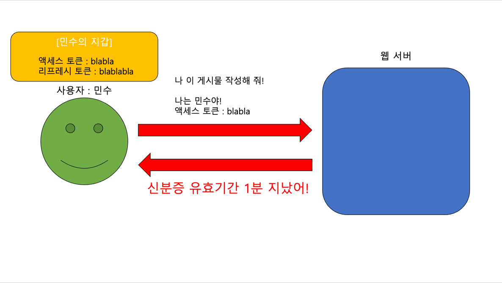
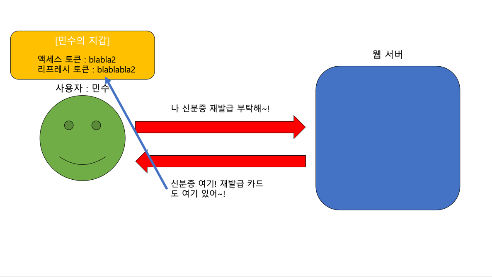

# simple-auth-example

간단한 인증 서버로 JWT 사용 방법을 익혀보세요!

### JWT (JSON Web Token) 이란?

#### 웹 서비스에서 인증의 필요성

JWT 에 대해서 이해하기 위해선 먼저 웹 서비스에서 인증이라는 개념에 대해 알아야 합니다.  
우리가 간단한 게시판 서비스를 만들었다고 가정해 보겠습니다. 게시판에는 게시물을 게시할 수도 있고, 수정하거나 삭제할 수도 있고, 조회할 수도 있습니다.  
보통은 "한국 사는 철수" 가 올린 게시물을 "미국 사는 스미스" 가 마음대로 삭제하거나 수정하도록 해서는 안 됩니다. 대부분의 게시판 서비스가 그러하듯이 말입니다. 내가 쓴 게시물이 하루아침에 누군가에 의해서 모두
사라져 버린다면, 아무도 그 서비스를 이용하지 않을 겁니다.

그러면 민수가 작성한 게시물을 스미스가 삭제하려고 한다면, 우리는 어떻게 그것을 막아야 할까요?  
가장 기본적인 것은 "이 게시물을 삭제하려고 하는 사람이 스미스여..민수여?" 를 서버가 알아차리게끔 하는 겁니다. 이를 인증(`Authentication` 이라고 하죠.) 그리고 이것을 수행하는 방법에는 여러
가지가 있습니다. 그 중 많이 쓰이는 방식 중 하나가 바로 JWT 입니다.

#### JWT (JSON Web Token) 이란?

좋아요. 그럼, JWT 란 뭘까요?  
프론트엔드와 백엔드가 분리되어 있는 애플리케이션 개발을 진행하다 보면, JWT 를 통해서 인증을 수행해야 할 일이 많습니다.  
JWT 는 `JSON Web Token` 의 약자로서, `RFC 7519` 에 정의된 "두 당사자 간에 전송될 클레임을 나타내는 안전한 방법" 입니다.  
[`RFC 7519`](https://www.rfc-editor.org/rfc/rfc7519) 에는 아래와 같이 소개되어 있습니다.

> JSON Web Token (JWT) is a compact, URL-safe means of representing
> claims to be transferred between two parties.
> The claims in a JWT are encoded as a JSON object that is used as the payload of a JSON
> Web Signature (JWS) structure or as the plaintext of a JSON Web
> Encryption (JWE) structure, enabling the claims to be digitally
> signed or integrity protected with a Message Authentication Code
(MAC) and/or encrypted.

> JSON 웹 토큰(JWT)은 두 당사자 간에 전송되는 클레임을 나타내는 간결한 URL 안전 수단입니다.
> JWT의 클레임은 JSON 웹 서명(JWS) 구조의 페이로드 또는 JSON 웹 암호화(JWE) 구조의 일반 텍스트로 사용되는 JSON 객체로 인코딩되어,
> 클레임을 디지털 서명하거나 MAC(메시지 인증 코드)로 무결성을 보호할 수 있습니다.

딱딱한 설명을 녹여 말랑하게, 조금 더 간단하게 말해 보겠습니다. *`JWT` 는 신분증 같은 겁니다.* 내가 "게시물 작성" 이라는 클럽에 들어가기 위해서 "JWT" 라는 신분증을 들이미는 거죠.  
그리고 그 신분증에는 주민등록증의 홀로그램 무늬처럼 "이 신분증은 변조되지 않았어요!" 를 말해주는 "서명" 이 들어있습니다. 누군가가 이 서명을 위조하거나, 변조하지 못하게끔 말이에요. 하지만 이런 JWT 인증
방식에도 문제점이 존재합니다. 어떤 문제점이 존재하고, 그것을 보완하는 방법은 무엇일까요?

#### JWT 의 문제점과 access token, refresh token 의 등장

그 문제점은 바로 "누군가가 토큰을 가져가 버리면 어떻게 하지?" 입니다. 실제 술집에서는 직원이 신분증의 증명사진과 얼굴을 대조해 보며 이 사람이 실제 신분증을 가지고 있는 사람인지를 확인하지만, 서버는 그렇지
않습니다. 얼굴도, 몸뚱아리도 없는 Request 에서 그를 식별할 수 있는 수단은 헤더에 담겨 있는 토큰 뿐입니다.  
그렇기에 누군가 내 토큰을 탈취해 버린다면 문제는 심각해집니다. 탈취한 토큰으로, "나는 논현동 사는 민수니까, 게시물 작성 좀 할게!" 를 난사하고 다니 상황이 벌어지는 거죠. 내 토큰을 탈취한 사람이 나인 척하며
불법 사이트를 마구마구 홍보하고 다닌다면.. 정말 끔찍합니다.  
  
이러한 상황을 방지하기 위해서, 똑똑하신 분들은 "리프레시 토큰" 이라는 방법을 고안해냅니다. 새로운 단어가 나왔지만, 아래의 글을 읽어본다면 이해가 될 거에요.  
  
지금까지 "신분증" 의 역할을 했던 토큰은 "액세스 토큰" 입니다. 액세스 토큰은 말 그대로 어딘가에 접근하려고 할 때, 신분증의 역할을 하게 됩니다. 하지만 위에서처럼, 누군가 내 신분증을 가져가 버린다면 그것을
막을 수가 없는 문제가 있었죠.  
그렇기에 이제는 "신분증", 즉 "액세스 토큰" 에 유효시간을 부여하기로 합니다. "이 신분증(액세스 토큰) 은 발급 후 10시간까지만 사용할 수 있어!" 를 정해주는 거죠. 그렇다면 누군가가 액세스 토큰을 가져가
버린다고 한들, 10시간 이후에는 사용할 수 없게 되므로 최소한의 안전장치가 만들어지는 셈이 됩니다.  
좋아요. 그러면 당연히 유효시간을 짧게 정하는 것이 보안에 유리하겠죠? 만약 유효시간이 1분이라면, 누군가가 내 토큰을 탈취해도 기껏해야 59초 밖에 사용하지 못하니까요.  
여기서 생기는 또 다른 문제는 사용자는 유효시간이 짧을수록 더 자주 로그인(신분증 발급) 을 해야 한다는 겁니다. 생각해 보세요. 어딘가에 로그인을 하고, 1분마다 로그인 페이지에서 아이디와 비밀번호를 사용해서
로그인을 해야 하다니.. 이런 서비스를 과연 누가 사용할까요? 저라면 안 쓸 겁니다.  
이럴 때에 사용하는 것이 바로 리프레시 토큰입니다. 리프레시 토큰은 새 신분증(액세스 토큰)을 다시 발급받을 수 있는 토큰입니다. 서버는 사용자가 아이디와 비밀번호를 치고 로그인할 때에 액세스 토큰과 리프레시 토큰
두 개를 발급해 줍니다. 사용자는 "현재로부터 일정 기간 동안 유효한 신분증(액세스 토큰)", "신분증(액세스 토큰) 을 다시 발급받을 수 있는 또 다른 카드" 를 발급받게 되는 거죠.  
그리고 일반적으로 리프레시 토큰의 경우 액세스 토큰보다 유효기간이 훨씬 긴 편입니다. 예를 들면, 액세스 토큰의 유효기간이 1일이라면 리프레시 토큰의 경우 2주, 한 달 정도 되는 거죠.  
*그러면 리프레시 토큰을 가지고 있다고 해서 액세스 토큰의 문제점을 어떻게 보완한다는 걸까요?*  
  
한번, 간단하게 우리의 로그인 흐름을 살펴볼게요. 잘 따라와 보세요!
  
<br/>
우리의 사용자 민수는 웹 서버에게 아이디와 비밀번호를 제공하며 "나 민수니까, 신분증 발급해 줘!" 를 요청합니다.
  
<br/>
그러면, 서버는 민수가 제출한 아이디와 비밀번호가 유효한지(우리 서비스의 회원이 맞는지) 를 검사한 후, 맞다면 민수에게 신분증과 신분증을 재발급할 수 있는 카드인 액세스 토큰, 리프레시 토큰을 전달해줍니다.  
우리 서비스의 경우, 액세스 토큰의 유효기간은 1분, 리프레시 토큰의 유효기간은 5분으로 정하겠습니다.
  
<br/>
이제 민수는 신분증과 카드를 발급받았으므로, 그것을 지갑에다가 저장해 두어야 합니다. 실제로 프론트엔드에서 이를 저장하는 방법은 여러 가지가 있습니다. 대표적으로는 `Cookie`, `LocalStorage` 와
같은 방법들이 있죠. 이를 간편하게 "지갑" 이라고 표현하겠습니다.
  
<br/>
민수는 신분증을 가지고 있으므로, 게시물을 삭제하거나 생성할 때에 그것을 들이밀며 "나 민수요!" 를 증명할 수 있습니다.
  
<br/>
마음껏 웹 서버에 요청을 보내던 민수는 우리의 서비스를 이용한 지 1분이 지났고, 신분증의 기간은 만료되었습니다. 그러면 서버는 민수가 제출한 신분증의 유효기간이 지났음을 확인하고 "이 신분증, 유효기간 지났어!"
를 응답합니다.
  
<br/>
그러면, 민수는 지갑에 가지고 있던 리프레시 토큰을 가지고 신분증 재발급 요청을 보냅니다. 그리고 서버는 신분증과 재발급 카드(액세스 토큰, 리프레시 토큰) 을 재발급해 주고, 민수는 발급받은 새 액세스 토큰과
리프레시 토큰을 지갑에 넣어두고, 나중에 요청을 보낼 때에 새로운 신분증을 이용하여 요청을 보냅니다.
  
이처럼 리프레시 토큰을 사용해서 클라이언트는 리프레시 토큰이 만료될 때까지 로그인을 유지할 수 있습니다. "리프레시 토큰을 사용해서 액세스 토큰을 재발급받는 것" 은 클라이언트 단 프로그래머의 몫입니다. 리프레시
토큰을 사용해서 액세스 토큰을 재발급받지만, 사용자는 마치 계속 로그인을 유지하는 것처럼 구현해 보세요. HTTP 프로토콜을 사용하므로 어떤 클라이언트 (iOS 앱, Android 앱, JavaScript 앱 등)
를 사용해도 문제는 없습니다.
  
### 프로젝트 설명

Flask 웹 프레임워크로 간단하게 인증 서버를 만들어보았습니다.  
해당 서버를 로컬에 띄운 다음, 액세스 토큰과 리프레시 토큰을 사용하는 방법을 연습해 보세요!  
최종 목표는, "액세스 토큰의 유효기간인 1분이 지난 이후에도 로그인이 유지되도록 하는 것" 입니다.

### 프로젝트 시작하기

#### 설치 전 필요한 것들

해당 서버는 `Flask 2.2` 를 기반으로 하여 작성되었습니다. 따라서, 아래의 요구사항들이 먼저 설치되어 있어야 합니다.

* python 3.7 and newer

```shell
python3 -V

#Python 3.11.1
```

python3.7 이상의 버전이 컴퓨터에 설치되어 있는지 꼭 확인해 주세요.

#### 설치하기

로컬 인증 서버를 설치하려면 아래의 가이드를 따르세요.

1. 먼저, git 저장소를 클론합니다.
```shell
git clone https://github.com/TGoddessana/simple-auth-example.git
```

2. 클론한 저장소로 이동합니다.
```shell
cd simple-auth-example/
```

3. python3 가상 환경을 설치합니다.
```shell
python3 -m venv venv
```

4. 가상환경을 활성화합니다.

```shell
# macOS or linux stuff
source venv/bin/activate
```

```shell
# windows
venv\Scripts\activate.bat
```

이후, 터미널에 `which python3` 을 입력하여 내 프로젝트 폴더의 venv 폴더가 나타나는지 꼭 확인하세요.

5. 필요한 `python` 패키지들을 설치합니다.
```shell
pip install -r requirements.txt
```

5. `flask` 서버를 구동합니다.
```shell
python ./app.py
```


#### API 스펙

- [POSTMAN 문서](https://documenter.getpostman.com/view/21924519/2s935uH1Lb) 에서 API 의 상세 스펙과 내용을 확인할 수 있습니다.

- 사용자는 총 3명이 존재하고, 각각의 username 과 password 정보는 아래와 같습니다. 각각 맞는 정보로 로그인을 시도하면, jwt 가 발급됩니다.
- ```python
  users = [
  {"id": 1, "username": "chulsu", "password": "1234"},
  {"id": 2, "username": "minsu", "password": "1229"},
  {"id": 3, "username": "satangsusu", "password": "4321"},]
  ```
- 서버에는 총 4개의 엔드포인트가 존재합니다.
    - `http://127.0.0.1:5000/login/` : 아이디와 비밀번호를 body 에 실어 보내야 합니다. `HTTP POST` 메서드만 허용됩니다.
    - `http://127.0.0.1:5000/refresh/` : `/login/` 으로 받은 리프레시 토큰을 사용해서 새로운 액세스 토큰과 리프레시 토큰을 발급받습니다. `HTTP POST` 메서드만
      허용됩니다.
    - `http://127.0.0.1:5000/protected/` : 액세스 토큰이 있어야만(로그인 한 상태여야지만) 접근이 가능한 엔드포인트입니다. 현재 로그인한 사람이 누구인지를 알려줍니다.
    - `http://127.0.0.1:5000/unprotected/` : 액세스 토큰이 없어도(로그인하지 않은 상태로도) 접근이 가능한 엔드포인트입니다.

#### 추가로 공부해보기를 추천하는 개념들

- HTTP 상태 코드 에 대해 알아두면 좋습니다. 서버는 인증 정보가 주어졌지만 알맞지 않은 경우 401 UNAUTHORIZED 상태 코드를 반환합니다.
    - 401 상태 코드와 403 상태 코드의 차이는 무엇인지를 정리해 보세요.
    - 100, 200, 300, 400, 500 번 대 상태 코드의 각각 차이가 무엇인지를 정리해 보세요.
- Refresh Token Rotation 이라는 개념이 존재합니다. 이것이 무엇을 의미하는지도 살펴보세요!
- Refresh Token 탈취에 대비하여, 서버는 어떤 보완책을 마련할 수 있는지에 대해서도 조사해 보세요.
- HTTP 의 특성 중, Stateless 가 무엇을 의미하는지, JWT 를 왜 Stateless 를 위해 사용하는지 정리해 보세요!